# Athena

## What is Athena
Athena is a all in one solution to parse and analyse informations includes in reports.

Whith that, Athena will allow nations to oversee the education system more efficiently and it will help them find and resolve any underlying issues.

With additional time, we could build a complete product, with a friendly interface and an API for others to make better use of our data. This hackathon was a great project and we hope to continue building on it.

## What does Athena can do ?
Athena can:
- Fetch primary information froms reports (Teaching quality, Quality of support, Pupils achivements, ...)
- Score each of the categories between 0 and 1
- Answer to simples and complexes questions about the rapport such as: "What teaching quality ?"
- Effectuate a sentiment analysis (labels are: 'good', 'neutral', 'bad')
- Summarize the rapport with a simple text resuming all the informations

## How to use it ?
1. Need to have ```dependencies``` installed
```bash
pip3 install -r requirements.txt
pip3 install jupyterlab
pip3 install notebook
```

2. Launch frontend
```bash
cd gchart
npm i
npm start
```

## How to test our NLP process ?
You can access to notebook exemple in `exemples/` folder.\
To run our exemple just type: `jupyter notebook <path_to_file>`.\
All the files of the jupyter notebook are in the directory ```examples/```.\
In particular, you can find two jupyter notebook ```multiples_predictions.ipynb``` and ```single_analysis.ipynb```.

For example if you are in root of repo:
```bash
jupyter notebook exemples/multiples_predictions.ipynb
# or
jupyter notebook exemples/single_analysis.ipynb
```

Please note that you need to have installed jupyter to run our notebooks.\
For more inforlations please refer to: [jupyter.org/install](https://jupyter.org/install)

# How's does it work ?
## NLP:
Going over the whole NLP process and how does it work is out of the scope of this document but we will see the main parts and why whe choosed Transformers rather than RNNs.\

Back to few years ago, most of the people who wanted to work with NLP was using RNNs but in 2017 a new deep learning model has been introduced: the Transformers\
We will not go into the deep why are Transformers so much better than RNNs but if there is one thing to remember: [Attention is all you need](https://arxiv.org/abs/1706.03762)...\
The Transformer model is able to look at every position in the sequence, at the same time, in one operation resulting in a huge improuvement over RNNs.

### Our process:

The first step in every project, NLP included is to analyse the probleme to better solve it.\
The second challend is parse and fetch needed information from raw data to build our solution, for this part we worked with text analysys and regex.\

Finally the data in hand we could set and use our Transformer model, we decided to work with [Hugging face's Tranfomers library](https://huggingface.co/transformers/) for it convienient and it low ressources cost.\
(Regarding to the subject, it's important to build a solution usable by most contry including with low IT ressources countrys.)

Hugging Face's library (HF) also provided some usefull high-level API for doing what we need.

Normaly before using our data you would need to tokenize it following this process:
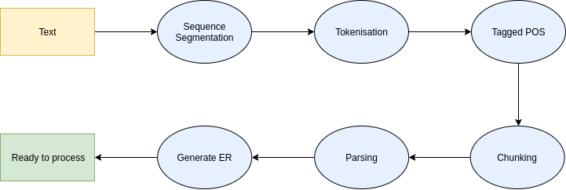\
But this process is pretty heavy, long and verry not friendly to IT neophyte, so HF provide what they call a tokernizer wich do this all process for you:
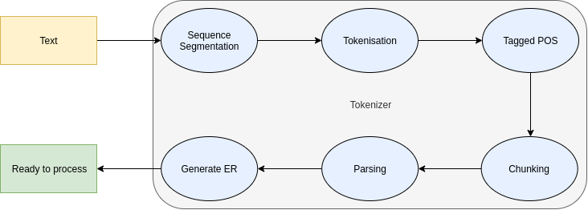

Now you just have to call the tokenizer and that it your data is ready to be used ! But it's only half the job...

Now we need to have a ready to use model, therefore a trained model, and training a model is time and money consuming.\
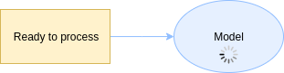

Is there not a solution ? Ofcourse there is and it's called pre-trained models!
HF also provide [a set of pre-trained models](https://huggingface.co/transformers/pretrained_models.html). You just have import and download it and that it! Much better no?\
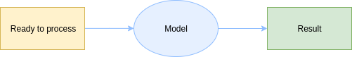

Ok, so now we have a tokenizer wich preprocess our data for us and on the other hand our model able of making predictions. It's perfect right ? Is there not bette? Really? Nothig? Ofcourse there is ! And it's called `Pipeline`.

A pipeline does all the time wasting jobs for you, you just avec to call it and that it !
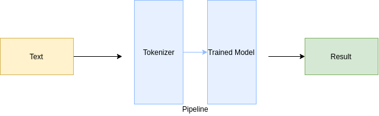

We choosed to use this pipeline to make it easyer to use for any one with low IT knoladge?
Once our Transformers in hand, you just add to process our analysis (Question Answering & Sentence Classification)

## Data visualisation:

Fetching data is great, but analysing raw data in text format is not very pleasant, this is why we created a map format to vizualise informations

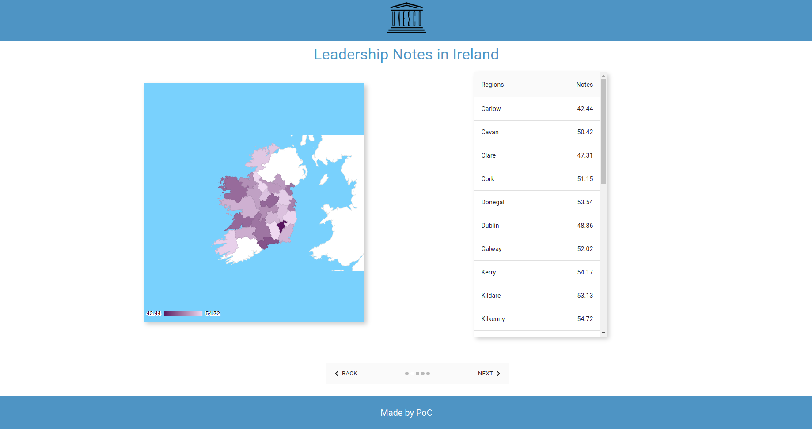

> :bulb: Check this [part](https://github.com/PoCInnovation/UNESCO-Hacking-ED-Planning/blob/master/README.md#how-to-use-it-) if you want to launch the web App by yourself.

# Our recommendations:

A great and simple way to improve possible futur datascientiste job on this subject, is to impose a standard format for the reprots.
You can find our recommendations on `Deliverable_3_List_of_recommendation_ATHENA.pdf`

# What Next:
Ofcourses, we already have many ideas to improve our solution such as:
- Show the evolution of scores over time for every schooles
- Correlation analysis of data to find the source of the problem
- Provision of the model via a REST API to provide acces to it to every country
- Provision of a discussion group to connect the different actors
- Set a standard report format

## Some screen shots ?
**Summary of a rapport**:\
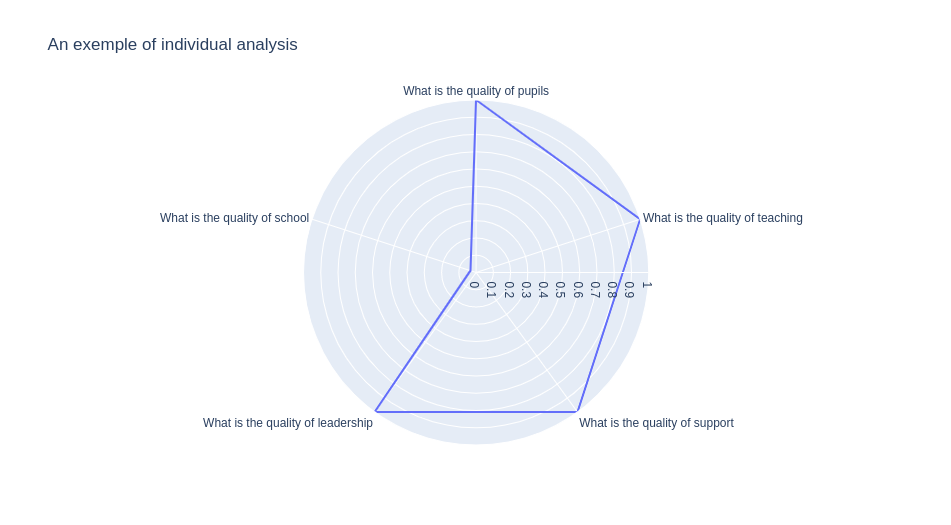

**Summary of a multiple rapports**: (note that there is an histogram for every categories)\
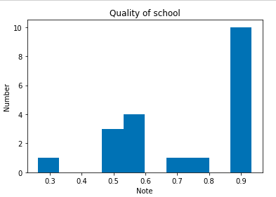

**QnA** (note that is anwser is made by the model and not in raw data)\
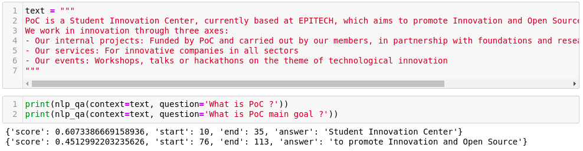

**sentiment analys** (note that is in real condition in the projet data are fetched from reports)\
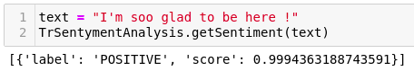

**Result in map**
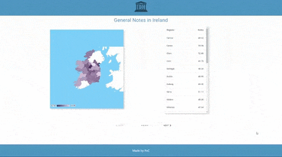

## Authors

 - [Valentin De Matos](https://www.linkedin.com/in/valentin-de-matos/)
 - [Tom Chauveau](https://github.com/TomChv)
 - [Roman Gascoin](https://www.linkedin.com/in/rgascoin/)
 - [Killian Clette](https://www.linkedin.com/in/killian-clette-06014b182/)
 - [Luca Georges francois](https://github.com/TomChv)
 - [Paul Cochet](https://github.com/Paul-Cochet)
 - [Coline Seguret](https://fr.linkedin.com/in/coline-seguret)
 - [Nefeli Paparisteidi](https://www.linkedin.com/in/nefeli-paparisteidi-2b479a78/)

 Made with **<3** by [PoC](https://www.poc-innovation.fr/)
